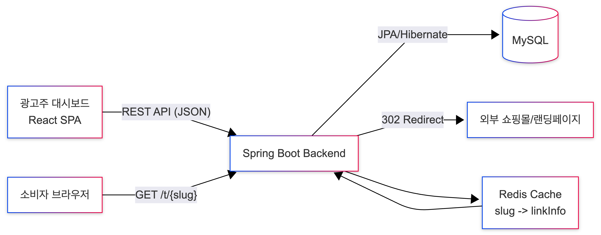
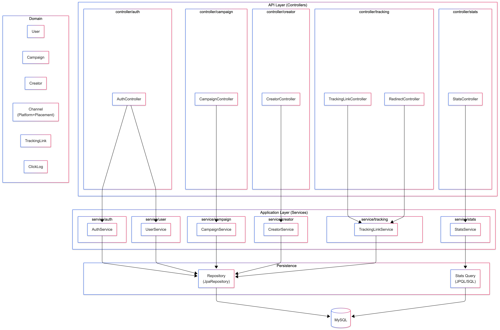
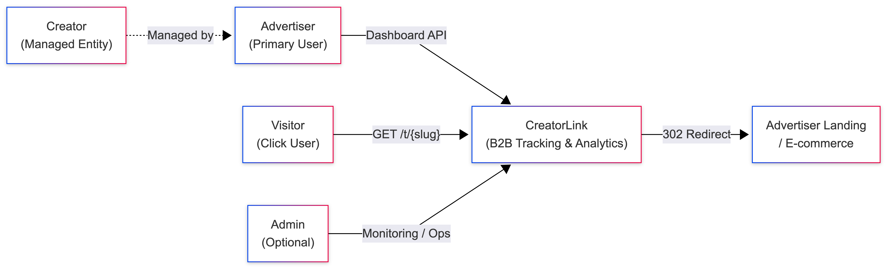
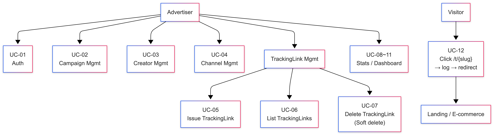
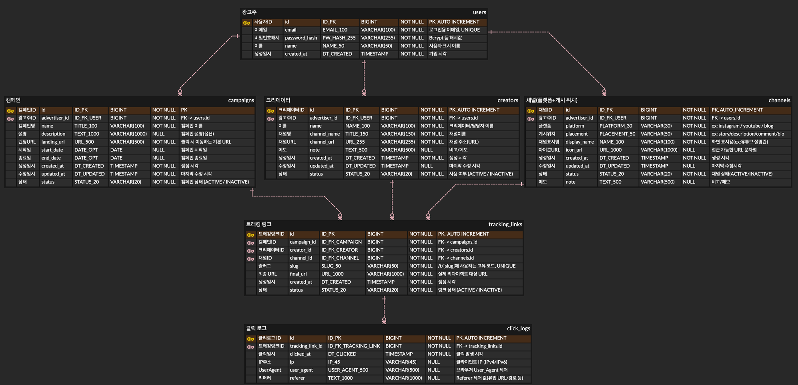
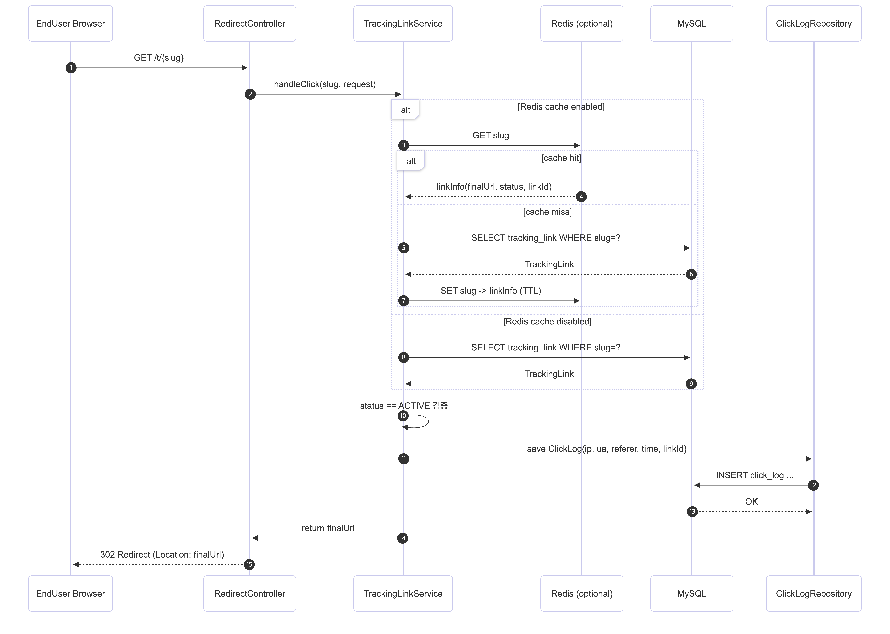
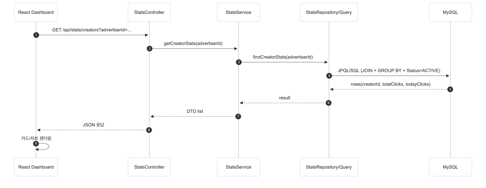
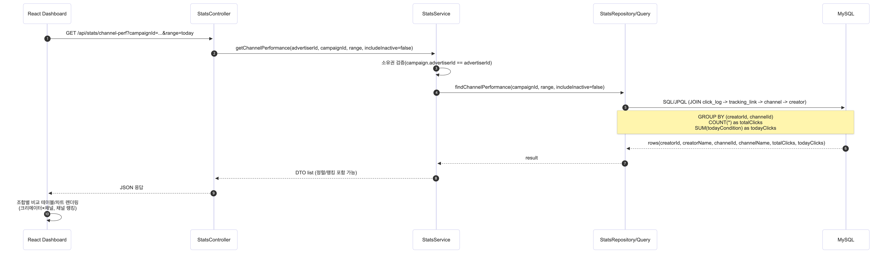

# CreatorLink

<div align="center">

**인플루언서 마케팅을 위한 성과 추적 플랫폼**

캠페인 × 크리에이터 × 채널 단위로 트래킹 링크를 발급하고, 클릭 로그를 수집·집계하여  
광고주가 성과를 비교·분석할 수 있는 B2B SaaS 백오피스

[](https://openjdk.org/)
[](https://spring.io/projects/spring-boot)
[](https://www.mysql.com/)
[](https://redis.io/)
[](https://www.docker.com/)

</div>

---

## 📋 Table of Contents

- [Overview](#-overview)
- [Problem & Solution](#-problem--solution)
- [Features](#-features)
- [Architecture](#-architecture)
- [Database Design](#-database-design)
- [Core Flows](#-core-flows)
- [Tech Stack](#-tech-stack)
- [Getting Started](#-getting-started)
- [API Documentation](#-api-documentation)
- [Performance Testing](#-performance-testing)
- [Project Structure](#-project-structure)
- [Roadmap](#-roadmap)
- [Contact](#-contact)

---

## 🎯 Overview

**CreatorLink**는 인플루언서 마케팅 캠페인의 성과를 정량적으로 추적하고 분석하는 B2B SaaS 플랫폼입니다.

> 💡 **백엔드 포트폴리오 목적의 프로젝트**  
> 현재 **AWS EC2**에서 **Docker Compose**(MySQL + Redis + Spring App)로 구동 중이며,  
> **k6 부하테스트 기반 성능 검증**을 진행하고 있습니다.

### Key Highlights

- ✅ **유일한 트래킹 링크 발급**: 캠페인 × 크리에이터 × 채널 조합으로 중복 없는 링크 생성
- 📊 **실시간 클릭 로그 수집**: IP, User Agent, Referer 등 상세 정보 기록
- 📈 **다차원 성과 분석**: 캠페인별/크리에이터별/채널별 성과 비교 대시보드
- ⚡ **성능 최적화**: 인덱싱, 캐싱, 부하테스트 기반 병목 개선

---

## 💡 Problem & Solution

### Problem

광고주는 여러 크리에이터에게 동시에 캠페인을 집행하지만,  
성과가 여러 플랫폼/게시 위치에 분산되면서 다음 문제가 반복됩니다:

- 🔗 **링크 관리의 복잡성**: UTM/단축링크가 늘어날수록 관리 불가능
- 📊 **수작업 집계**: "누가/어디서/얼마나" 성과를 냈는지 Excel로 수작업 집계
- ⏱️ **느린 의사결정**: 캠페인·크리에이터·채널별 비교가 어려워 전략 수정이 지연

### Solution

CreatorLink는 **링크 클릭 로그 기반으로 성과를 정량화**하고,  
**캠페인·크리에이터·채널 단위로 비교 가능한 대시보드**를 제공합니다.

- 자동화된 링크 발급 및 클릭 추적
- 실시간 성과 집계 및 비교 분석
- 데이터 기반 의사결정 지원

---

## ✨ Features

### ✅ Implemented

<details>
<summary><b>인증 및 계정 관리</b></summary>

- 광고주 계정 생성 (`POST /api/auth/signup`)
- 광고주별 리소스 격리 (소유권 검증)

</details>

<details>
<summary><b>캠페인 관리</b></summary>

- 캠페인 생성/조회/삭제 (Soft delete)
- 캠페인별 성과 통계 조회
- 상태 기반 필터링 (ACTIVE/INACTIVE)

</details>

<details>
<summary><b>크리에이터 & 채널 관리</b></summary>

- 광고주 소유 크리에이터 생성/조회/삭제
- 채널(플랫폼 + 게시 위치) 생성/조회/삭제
- Soft delete로 히스토리 보존

</details>

<details>
<summary><b>트래킹 링크 발급</b></summary>

- 캠페인 × 크리에이터 × 채널 조합으로 **유일한 ACTIVE 링크** 생성
- Slug 기반 외부 공개 URL: `/t/{slug}`
- 소유권/정합성 강제 (다른 광고주 리소스 혼합 연결 차단)

</details>

<details>
<summary><b>클릭 수집 & 리다이렉트</b></summary>

- `GET /t/{slug}` 요청 시 ClickLog 저장 후 302 Redirect
- IP, User Agent, Referer, 클릭 시각 기록
- 비동기 로깅으로 리다이렉트 속도 보장

</details>

<details>
<summary><b>성과 분석 대시보드</b></summary>

- 캠페인별/크리에이터별 클릭 통계
- **조합별 성과 비교** (Creator × Channel, 0 클릭 포함)
- **채널 랭킹** Top-N
- 기간 필터링 (Today, Range, Total)

</details>

### 🚧 In Progress

- **성능 검증 (EC2 + k6)**
  - Mixed Traffic(리다이렉트 + UC-10 혼합) 부하 테스트
  - p95/p99 레이턴시, DB 병목 분석
  - Redis TTL 캐시 적용 전/후 비교

### 🧭 Roadmap

- [ ] JWT 기반 인증/인가 (advertiserId 요청 바디 제거)
- [ ] 통계 API 캐시/집계 테이블/배치(일별 집계) 확장
- [ ] 운영 안전장치 (Rate Limit, Throttling)
- [ ] 관측/모니터링 (로그 표준화, CloudWatch/Prometheus 등)

---

## 🏗️ Architecture

### System Overview
<!--```
┌─────────────────┐
│ React Dashboard │
└────────┬────────┘
         │ HTTPS
         ▼
┌─────────────────────┐      ┌─────────┐
│ Spring Boot         │◄────►│  Redis  │
│ REST API            │      │  Cache  │
└────────┬────────────┘      └─────────┘
         │ JDBC
         ▼
┌─────────────────────┐
│      MySQL          │
│   (Click Logs +     │
│    Master Data)     │
└─────────────────────┘
```
-->



### Backend Architecture



#### Actors & System Boundary


#### Use Case Overview


### Traffic Patterns

- **외부 공개 트래킹** (쓰기 중심)
  - `GET /t/{slug}` → ClickLog INSERT + 302 Redirect
  - 빠른 응답 필요, 대량 트래픽 대응
  
- **내부 분석 대시보드** (읽기/집계 중심)
  - UC-10 (조합/랭킹) → JOIN + GROUP BY + 기간 필터
  - 복잡한 집계 쿼리, 캐시 활용 필요

> 💡 서로 성격이 다른 트래픽을 동시에 만족해야 하므로  
> 인덱스/캐시/부하테스트 기반으로 병목을 분리 검증하는 방식으로 설계했습니다.

---

## 🗄️ Database Design

### Entity Relationship Diagram



### Domain Model

**핵심 엔티티**
- **User (Advertiser)**: 광고주 계정
- **Campaign**: 캠페인 단위
- **Creator**: 크리에이터(인플루언서)
- **Channel**: 플랫폼 + 게시 위치
- **TrackingLink**: 캠페인 × 크리에이터 × 채널 조합
- **ClickLog**: 클릭 이벤트 로그

**설계 원칙**
- **Soft Delete**: Status 기반 논리 삭제로 히스토리 보존
- **소유권 강제**: 링크 생성 시 advertiser 일치 검증으로 데이터 정합성 보장
- **인덱싱 전략**: 읽기(집계)/쓰기(로그) 패턴에 맞춘 복합 인덱스 설계

---

## 🔄 Core Flows

### 1. Click Tracking & Redirect



**주요 단계**
1. 외부 사용자가 `/t/{slug}` 접근
2. TrackingLink 조회 (ACTIVE 상태 검증)
3. ClickLog 저장 (IP, User Agent, Referer 기록)
4. 302 Redirect로 원본 URL로 이동

**성능 고려사항**
- 단일 쿼리로 TrackingLink 조회
- 비동기 로깅 검토 (리다이렉트 지연 최소화)
- Redis 캐싱으로 DB 부하 감소

### 2. Dashboard Statistics Flow



**주요 단계**
- 캠페인별/크리에이터별 클릭 통계 조회
- 기간 필터링 (Today, Range, Total)
- GROUP BY 집계 쿼리 최적화

### 3. UC-10 Performance Comparison Flow



**주요 단계**
- Creator × Channel 조합별 성과 비교 (0 클릭 포함)
- 채널 랭킹 Top-N 조회
- 복합 JOIN 쿼리 + 인덱싱 최적화

---

## 🛠️ Tech Stack

### Backend
- **Language**: Java 17
- **Framework**: Spring Boot 3.x
- **ORM**: Spring Data JPA
- **Validation**: Spring Validation
- **API Documentation**: Springdoc OpenAPI (Swagger UI)

### Database & Cache
- **RDBMS**: MySQL 8.0
- **Cache**: Redis 7.x (통계 응답 TTL 캐싱)

### Infrastructure
- **Cloud**: AWS EC2
- **Containerization**: Docker, Docker Compose

### Testing & Monitoring
- **Load Testing**: k6
- **Performance Metrics**: p50, p95, p99, throughput

---

## 🚀 Getting Started

### Prerequisites
```bash
# Required
- JDK 17+
- Docker & Docker Compose

# Optional (for development)
- MySQL Workbench
- Postman or any REST client
```

### Local Development
```bash
# 1. Clone the repository
git clone https://github.com/yourusername/creatorlink.git
cd creatorlink

# 2. Run with Gradle
./gradlew bootRun

# 3. Access Swagger UI
open http://localhost:8080/swagger-ui/index.html
```

### Docker Compose (Staging/Production)
```bash
# 1. Build and run with Docker Compose
docker-compose up -d

# 2. Check logs
docker-compose logs -f app

# 3. Stop services
docker-compose down
```

### Environment Variables
```properties
# application-staging.properties
spring.datasource.url=jdbc:mysql://mysql:3306/creatorlink
spring.datasource.username=${DB_USERNAME}
spring.datasource.password=${DB_PASSWORD}

spring.redis.host=redis
spring.redis.port=6379
```

> ⚠️ **Security Note**: 운영 환경에서는 환경변수 또는 AWS Secrets Manager로 비밀값 관리 예정

---

## 📚 API Documentation

### Authentication
- `POST /api/auth/signup` - 광고주 계정 생성

### Core Resources
- `POST /api/campaigns` - 캠페인 생성
- `GET /api/campaigns` - 캠페인 목록 조회
- `POST /api/creators` - 크리에이터 생성
- `POST /api/channels` - 채널 생성
- `POST /api/tracking-links` - 트래킹 링크 발급

### Tracking & Redirect
- `GET /t/{slug}` - 클릭 로그 저장 및 리다이렉트

### Statistics & Analytics
- `GET /api/stats/campaigns` - 캠페인별 통계
- `GET /api/stats/creators` - 크리에이터별 통계

### Performance Comparison (UC-10)
```http
GET /api/stats/campaigns/{campaignId}/combinations
    ?from=YYYY-MM-DD
    &to=YYYY-MM-DD
```
- Creator × Channel 조합별 클릭 수 (0 클릭 포함)
- Today / Range / Total 집계
```http
GET /api/stats/campaigns/{campaignId}/channels/ranking
    ?from=YYYY-MM-DD
    &to=YYYY-MM-DD
    &limit=10
```
- 채널 랭킹 Top-N

### Full API Documentation
- **Swagger UI**: `http://localhost:8080/swagger-ui/index.html`
- **OpenAPI Spec**: `http://localhost:8080/v3/api-docs`

---

## ⚡ Performance Testing

CreatorLink는 `/t/{slug}` (쓰기)와 UC-10 (읽기/집계)을 동시에 만족해야 하므로,  
**실험 기반 점진적 최적화**를 진행합니다.

### Test Scenarios

| Experiment | Description | Expected Impact |
|------------|-------------|-----------------|
| **E1** | ClickLog 기간 집계 인덱스 | GROUP BY 쿼리 성능 개선 |
| **E2** | TrackingLink ACTIVE 필터 인덱스 | JOIN 후보군 축소 |
| **E3** | UC-10 응답 Redis TTL 캐시 | DB 부하 감소, 응답 속도 향상 |

### k6 Load Testing
```bash
# Example: Mixed traffic test
k6 run --vus 100 --duration 5m scripts/mixed-traffic.js
```

**측정 지표**
- **Response Time**: p50, p95, p99
- **Throughput**: requests/sec
- **Error Rate**: %
- **Database Connections**: active/idle

> 📊 현재 EC2 환경에서 측정 환경/지표/템플릿 구성 완료,  
> seed 데이터 및 실측 결과 수집 진행 중

---

## 📁 Project Structure
```
BE/
├── src/
│   ├── main/
│   │   ├── java/com/jung/creatorlink/
│   │   │   ├── domain/          # 도메인 엔티티
│   │   │   ├── dto/              # 요청/응답 DTO
│   │   │   ├── repository/       # JPA Repository
│   │   │   ├── service/          # 비즈니스 로직
│   │   │   └── controller/       # REST API 컨트롤러
│   │   └── resources/
│   │       ├── application.properties
│   │       └── application-staging.properties
│   └── test/                     # 단위/통합 테스트
├── scripts/
│   └── k6/                       # 부하 테스트 스크립트
├── docs/
│   └── images/                   # 다이어그램 이미지
├── docker-compose.yml
├── Dockerfile
└── build.gradle
```

---

## 🗺️ Roadmap

### Phase 1: Core Features ✅
- [x] 기본 CRUD (Campaign, Creator, Channel, TrackingLink)
- [x] 클릭 수집 및 리다이렉트
- [x] 통계 조회 및 성과 비교 API

### Phase 2: Performance & Stability 🚧
- [x] k6 부하 테스트 환경 구축
- [ ] 인덱스 최적화 및 성능 검증
- [ ] Redis 캐싱 적용
- [ ] Rate Limiting & Throttling

### Phase 3: Production Ready 🧭
- [ ] JWT 인증/인가
- [ ] 일별 집계 배치
- [ ] 로그 표준화 및 모니터링
- [ ] CI/CD 파이프라인 구축

### Phase 4: Advanced Features 💡
- [ ] 이벤트 기반 실시간 대시보드 (WebSocket/SSE)
- [ ] 다중 리전 배포
- [ ] A/B 테스트 기능

---

## 👤 Contact

**Woong Jung** - Backend Developer

- 📧 Email: kaka366@naver.com

<!--
- 💼 GitHub: [@yourusername](https://github.com/yourusername)
- 🔗 LinkedIn: [your-profile](https://linkedin.com/in/your-profile)
-->

---

## 📄 License

This project is licensed under the MIT License - see the [LICENSE](LICENSE) file for details.

---

<div align="center">

**Made with ❤️ for better influencer marketing analytics**

If you found this project helpful, please consider giving it a ⭐️

</div>
