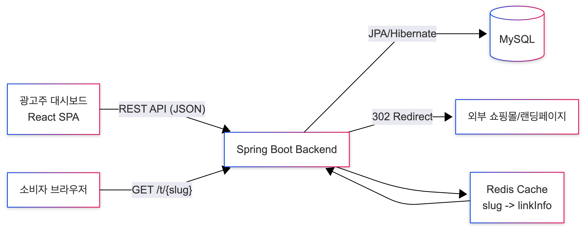
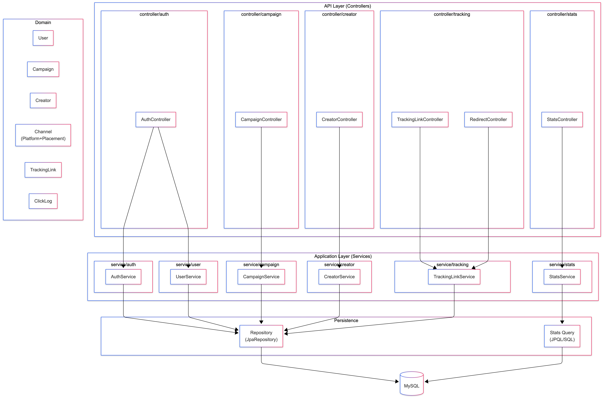
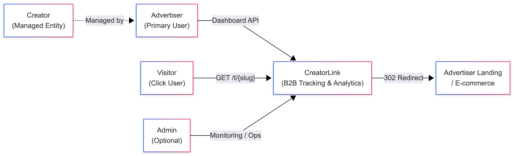
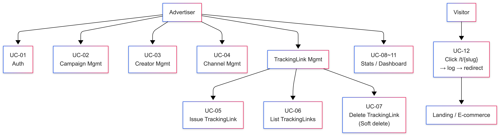
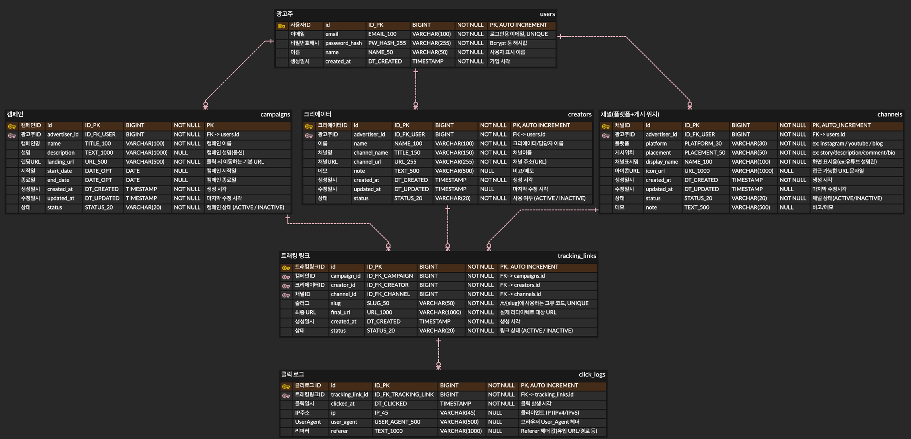
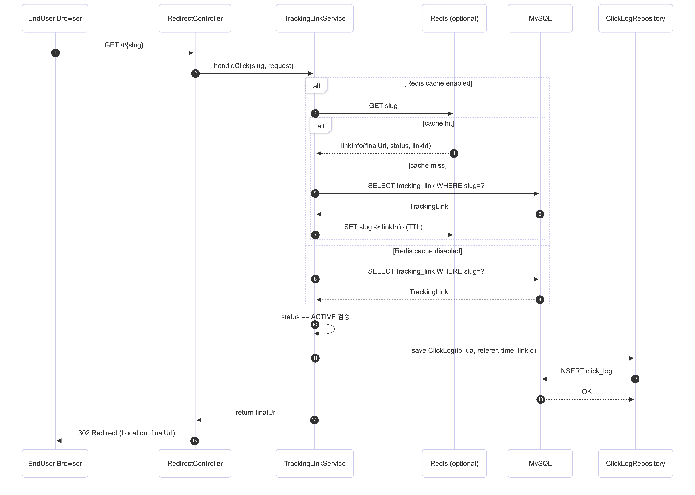
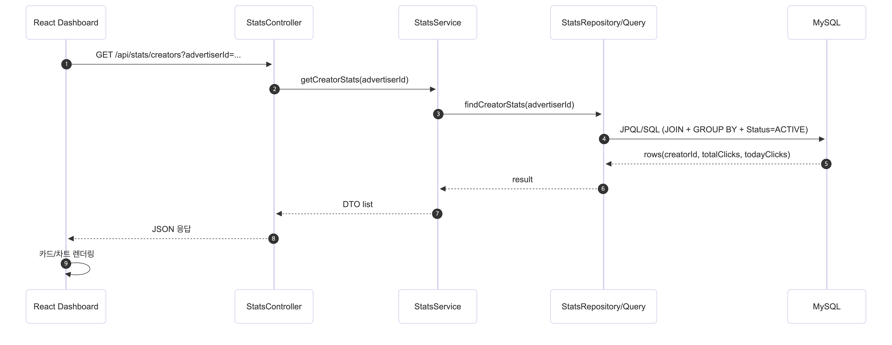
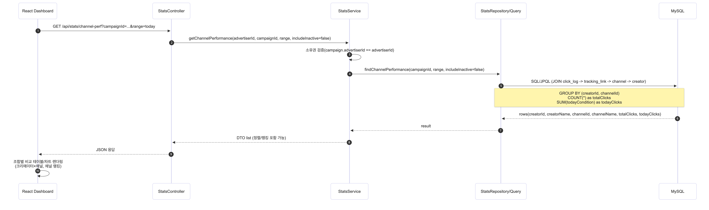

# CreatorLink

<div align="center">

**인플루언서 마케팅을 위한 성과 추적 플랫폼**

캠페인 × 크리에이터 × 채널 단위로 트래킹 링크를 발급하고, 클릭 로그를 수집·집계하여
광고주가 성과를 비교·분석할 수 있는 B2B SaaS 백오피스

[](https://openjdk.org/)
[](https://spring.io/projects/spring-boot)
[](https://www.mysql.com/)
[](https://redis.io/)
[](https://www.docker.com/)

</div>

---

## Key Results

ClickLog **1,000만 건** 환경에서 기간(from~to) 기반 통계 API에 동시 요청 장애(Timeout)를 재현하고,
병목의 구조적 원인을 분해하여 단계적으로 개선했습니다.

| 지표 | Before → After |
|------|----------------|
| 단일 요청 응답 시간 (Cache HIT) | **97s → 0.85s** |
| 동시 요청 실패율 (k6 1~5 RPS) | **100% → 0%** |
| Median Latency (k6 동시 요청) | **≈2m59s → 30s → 678ms** |
| 집계 쿼리 EXPLAIN ANALYZE | **~40min → 77s** |

> 평균 응답시간이 아니라 **DB 커넥션 점유 시간과 시스템 가용성**을 기준으로 문제를 정의하고,
> EXPLAIN / EXPLAIN ANALYZE → k6 부하 테스트 지표로 병목을 검증했습니다.
> 자세한 분석 과정은 [Performance Optimization](#performance-optimization) 참고.

---

## Table of Contents

- [Overview](#overview)
- [Problem & Solution](#problem--solution)
- [Features](#features)
- [Architecture](#architecture)
- [Database Design](#database-design)
- [Core Flows](#core-flows)
- [Performance Optimization](#performance-optimization)
- [Tech Stack](#tech-stack)
- [Getting Started](#getting-started)
- [API Documentation](#api-documentation)
- [Roadmap](#roadmap)
- [Links](#links)

---

## Overview

**CreatorLink**는 인플루언서 마케팅 캠페인의 성과를 정량적으로 추적하고 분석하는 B2B SaaS 백오피스 백엔드입니다.
단순한 CRUD가 아니라, 실제 서비스 환경에서 반복적으로 발생하는 문제(데이터 정합성, 대량 데이터 기반 통계, 성능 병목, 운영 환경 구성)를 직접 설계하고 해결하는 것을 목표로 진행한 백엔드 포트폴리오 프로젝트입니다.

현재 **AWS EC2**에서 **Docker Compose**(MySQL + Redis + Spring App)로 구동하며, **k6 부하 테스트**로 운영 환경과 유사한 조건에서 성능을 검증했습니다.

**핵심 특징**

- **유일한 트래킹 링크 발급**: 캠페인 × 크리에이터 × 채널 조합으로 중복 없는 ACTIVE 링크 생성
- **실시간 클릭 로그 수집**: `GET /t/{slug}` 요청 시 IP·User Agent·Referer 기록 후 302 Redirect
- **다차원 성과 분석**: 캠페인별 / 크리에이터별 / 채널별 성과 비교 대시보드 (조합별·랭킹 포함)
- **성능 최적화**: 인덱스 설계, Redis 캐시, 부하 테스트 기반 병목 분해·개선

---

## Problem & Solution

### Problem

광고주는 여러 크리에이터에게 동시에 캠페인을 집행하지만, 성과가 여러 플랫폼·게시 위치에 분산되면서 다음 문제가 반복됩니다.

- **링크 관리의 복잡성**: UTM / 단축링크가 늘어날수록 관리가 어려워짐
- **수작업 집계**: "누가 / 어디서 / 얼마나" 성과를 냈는지 Excel로 수작업 집계
- **느린 의사결정**: 캠페인·크리에이터·채널별 비교가 어려워 전략 수정이 지연

### Solution

CreatorLink는 **링크 클릭 로그 기반으로 성과를 정량화**하고, **캠페인·크리에이터·채널 단위로 비교 가능한 대시보드**를 제공합니다.

- 자동화된 링크 발급 및 클릭 추적
- 실시간 성과 집계 및 조합별 비교 분석
- 데이터 기반 의사결정 지원

---

## Features

**인증 및 계정 관리**
- 광고주 계정 생성 (`POST /api/auth/signup`)
- 광고주별 리소스 격리 (소유권 검증)

**캠페인 관리**
- 캠페인 생성 / 조회 / 삭제 (Soft Delete)
- 캠페인별 성과 통계 조회
- 상태 기반 필터링 (ACTIVE / INACTIVE)

**크리에이터 & 채널 관리**
- 광고주 소유 크리에이터 생성 / 조회 / 삭제
- 채널(플랫폼 + 게시 위치) 생성 / 조회 / 삭제
- Soft Delete로 히스토리 보존

**트래킹 링크 발급**
- 캠페인 × 크리에이터 × 채널 조합으로 **유일한 ACTIVE 링크** 생성
- Slug 기반 외부 공개 URL: `/t/{slug}`
- 소유권 / 정합성 강제 (다른 광고주 리소스 혼합 연결 차단)

**클릭 수집 & 리다이렉트**
- `GET /t/{slug}` 요청 시 ClickLog 저장 후 302 Redirect
- IP, User Agent, Referer, 클릭 시각 기록

**성과 분석 대시보드 (UC-10)**
- 캠페인별 / 크리에이터별 클릭 통계
- **조합별 성과 비교** (Creator × Channel, 0 클릭 포함)
- **채널 랭킹** Top-N
- 기간 필터링 (Today, Range, Total)

---

## Architecture

### System Overview



### Backend Architecture



#### Actors & System Boundary



#### Use Case Overview



### Traffic Patterns

- **외부 공개 트래킹** (쓰기 중심)
  - `GET /t/{slug}` → ClickLog INSERT + 302 Redirect
  - 빠른 응답 필요, 대량 트래픽 대응
- **내부 분석 대시보드** (읽기 / 집계 중심)
  - UC-10 (조합 / 랭킹) → JOIN + GROUP BY + 기간 필터
  - 복잡한 집계 쿼리, 캐시 활용 필요

> 성격이 다른 두 트래픽을 동시에 만족해야 하므로, 인덱스 / 캐시 / 부하 테스트로 병목을 분리 검증하는 방식으로 설계했습니다.

---

## Database Design

### Entity Relationship Diagram



### Domain Model

**핵심 엔티티**
- **User (Advertiser)**: 광고주 계정
- **Campaign**: 캠페인 단위
- **Creator**: 크리에이터(인플루언서)
- **Channel**: 플랫폼 + 게시 위치
- **TrackingLink**: 캠페인 × 크리에이터 × 채널 조합
- **ClickLog**: 클릭 이벤트 로그

**설계 원칙**
- **Soft Delete**: ClickLog를 제외한 도메인 엔티티에 `status`(ACTIVE / INACTIVE) 기반 논리 삭제 적용으로 히스토리 보존. 대부분의 조회 쿼리는 `status = 'ACTIVE'` 조건을 기본으로 포함하며, 통계 조회에서도 해당 조건을 전제로 조인 경로가 구성됩니다.
- **소유권 강제**: 링크 생성 시 advertiser 일치를 Service 계층에서 검증하여 데이터 정합성 보장
- **인덱싱 전략**: 읽기(집계) / 쓰기(로그) 패턴에 맞춘 복합 인덱스 설계

---

## Core Flows

### 1. Click Tracking & Redirect



1. 외부 사용자가 `/t/{slug}` 접근
2. TrackingLink 조회 (ACTIVE 상태 검증)
3. ClickLog 저장 (IP, User Agent, Referer 기록)
4. 302 Redirect로 원본 URL 이동

### 2. Dashboard Statistics Flow



- 캠페인별 / 크리에이터별 클릭 통계 조회
- 기간 필터링 (Today, Range, Total)
- GROUP BY 집계 쿼리

### 3. UC-10 Performance Comparison Flow



- Creator × Channel 조합별 성과 비교 (0 클릭 포함)
- 채널 랭킹 Top-N 조회
- 복합 JOIN 쿼리 + 인덱싱 최적화

---

## Performance Optimization

ClickLog **1,000만 건** 환경에서 기간(from~to) 기반 UC-10 통계 API를 실행했을 때 발생한 동시 요청 장애를, 병목의 구조적 원인을 분해하며 단계적으로 개선한 과정입니다.

### Problem — 1,000만 건 환경에서 통계 API 동시 요청 실패 (Timeout)

`click_logs`에 1,000만 건을 적재한 환경에서 기간 기반 통계 API를 실행하자:

- 단일 요청 **97s**
- k6 1~5 RPS 부하 테스트에서 **Error Rate 100%**
- 부하 테스트 중 **HikariCP connection pool 고갈 → connectionTimeout(30s) 후 timeout**

원인은 느린 집계 쿼리와, 동시 요청 상황에서 커넥션 점유 시간이 길어지는 구조적 병목이었습니다.

1. `click_logs`에서 기간(`clicked_at`) 기반 집계로 대량 row 접근 발생
2. ACTIVE 조건이 조인 초기에 적용되지 않아 조인 후보군이 불필요하게 확장
3. 결과적으로 요청당 DB 커넥션 점유 시간이 길어져 connection pool 고갈 → timeout

### Solution — 병목을 단계적으로 분해하여 개선

#### 1. Covering Index — `click_logs` 본체 접근 제거

- 기본 FK 단일 인덱스 → `(tracking_link_id, clicked_at)` 복합 인덱스로 확장
- Covering Index로 `click_logs` 테이블 본체 접근 제거 (Scan 비용 감소)
- 결과: 단일 요청 **97s → 79s**, EXPLAIN ANALYZE 기준 `click_logs` 접근 actual time **5403ms → 11.7ms** (per loop, loops·처리 row 동일)

#### 2. 조인 후보군 축소 — 조인 이전 단계에서 ACTIVE 링크 확정

- `(FK, status)` 복합 인덱스로 ACTIVE 링크 집합을 조인 이전에 먼저 확정
- 조인 후보군 축소 및 실행계획상 조인 순서(Join Order) 개선
- 결과: 집계 쿼리 EXPLAIN ANALYZE **~40min → 77s**

> 여기까지 쿼리 구조는 개선됐지만, 10M 반복 집계 구조 자체는 그대로여서 동시 요청 환경에서는 여전히 커넥션이 장시간 점유되며 connection pool 고갈이 남아 있었습니다. (실패 경계가 k6 HTTP timeout에서 connection pool timeout으로 이동한 상태)

#### 3. Redis TTL 캐시 — 반복 집계 제거

- 동일 조건 조회가 반복되는 통계 API 특성에 맞춰 Redis TTL 캐시 도입
- Cache HIT 요청은 10M 집계를 수행하지 않고 Redis에서 즉시 응답

#### 4. Cache Stampede 방지 — 부하 테스트 중 발견한 문제

- 캐시 miss 시 다수 요청이 동시에 DB를 조회하는 Cache Stampede 문제를 부하 테스트 과정에서 확인
- 락 + double-check로 **단일 요청만 DB 집계를 수행하도록** 제어

#### 5. `@Transactional` 경계 분리 — 커넥션 점유 해소

- Cache HIT 요청이 DB 커넥션을 점유하지 않도록 트랜잭션 경계 분리
- HikariCP 커넥션 점유 시간 단축 → pool 고갈 문제 해소

### Result

| 지표 | Before → After |
|------|----------------|
| 단일 요청 응답 시간 (Cache HIT) | 97s → **0.85s** |
| 동시 요청 실패율 | 100% → **0%** |
| Median Latency (k6 동시 요청) | ≈2m59s → 30s → **678ms** |
| 집계 쿼리 EXPLAIN ANALYZE | ~40min → **77s** |

대량 클릭 이벤트 데이터를 집계하는 통계 API가 실제 서비스에서 동작 가능한 수준으로 복구되었습니다.

### Engineering Insights

- 서비스 장애의 원인을 단순한 쿼리 실행시간 문제로만 보지 않고, 테이블 접근 비용(DB 디스크 I/O), 처리 데이터 규모, 동시성 영향으로 분해하여 분석
- EXPLAIN → EXPLAIN ANALYZE → k6 부하 테스트로 실행계획과 실제 지표 기반 병목 검증
- 캐시 도입을 단순 응답 개선이 아니라 Cache Stampede와 트랜잭션 경계까지 고려한 운영 관점의 설계로 적용

---

## Tech Stack

**Backend**
- Language: Java 17
- Framework: Spring Boot 3.x
- ORM: Spring Data JPA
- Validation: Spring Validation
- API Docs: Springdoc OpenAPI (Swagger UI)

**Database & Cache**
- RDBMS: MySQL 8.0
- Cache: Redis 7.x (통계 응답 TTL 캐싱)

**Infrastructure**
- Cloud: AWS EC2
- Containerization: Docker, Docker Compose

**Testing & Monitoring**
- Load Testing: k6
- Metrics: p50, p95, p99, throughput, error rate

---

## Getting Started

### Prerequisites

```bash
- JDK 17+
- Docker & Docker Compose
# Optional: MySQL Workbench, Postman
```

### Local Development

```bash
# 1. Clone
git clone https://github.com/brilliant13/creatorlink.git
cd creatorlink

# 2. Run
./gradlew bootRun

# 3. Swagger UI
open http://localhost:8080/swagger-ui/index.html
```

### Docker Compose

```bash
docker-compose up -d        # build & run
docker-compose logs -f app  # logs
docker-compose down         # stop
```

### Environment Variables

```properties
# application-staging.properties
spring.datasource.url=jdbc:mysql://mysql:3306/creatorlink
spring.datasource.username=${DB_USERNAME}
spring.datasource.password=${DB_PASSWORD}

spring.redis.host=redis
spring.redis.port=6379
```

> 운영 환경에서는 환경변수 또는 AWS Secrets Manager로 비밀값 관리 예정

---

## API Documentation

**Authentication**
- `POST /api/auth/signup` — 광고주 계정 생성

**Core Resources**
- `POST /api/campaigns` — 캠페인 생성
- `GET /api/campaigns` — 캠페인 목록 조회
- `POST /api/creators` — 크리에이터 생성
- `POST /api/channels` — 채널 생성
- `POST /api/tracking-links` — 트래킹 링크 발급

**Tracking & Redirect**
- `GET /t/{slug}` — 클릭 로그 저장 및 리다이렉트

**Statistics & Analytics (UC-10)**

```http
GET /api/stats/campaigns/{campaignId}/combinations?from=YYYY-MM-DD&to=YYYY-MM-DD
```
Creator × Channel 조합별 클릭 수 (0 클릭 포함, Today / Range / Total)

```http
GET /api/stats/campaigns/{campaignId}/channels/ranking?from=YYYY-MM-DD&to=YYYY-MM-DD&limit=10
```
채널 랭킹 Top-N

**Full API Docs**
- Swagger UI: `http://localhost:8080/swagger-ui/index.html`
- OpenAPI Spec: `http://localhost:8080/v3/api-docs`

---

## Roadmap

### Done

- [x] 기본 CRUD (Campaign, Creator, Channel, TrackingLink) + Soft Delete
- [x] 클릭 수집 및 리다이렉트 (`/t/{slug}`)
- [x] 통계 조회 및 조합별 성과 비교 API (UC-10)
- [x] k6 부하 테스트 환경 구축 및 실측
- [x] 인덱스 최적화 (Covering Index, 조인 후보군 축소)
- [x] Redis TTL 캐시 + Cache Stampede 방지 + `@Transactional` 경계 분리

### Next

- [ ] **JWT 기반 인증/인가** — `advertiserId` 요청 파라미터 제거, SecurityContext 기반 리소스 접근 검증
- [ ] **Rate Limit / Abuse 방어** — 공개 엔드포인트(`/t/{slug}`) IP 기준 요청 제한
- [ ] **관측 / 모니터링** — Micrometer / CloudWatch로 응답시간(p95/p99), DB 커넥션 풀 상태, 시스템 리소스 관측
- [ ] **ClickLog 쓰기 병목 확장 대응** — Flash Crowd 상황 대비 Kafka / Redis Stream 기반 비동기 적재
- [ ] **일별 집계 배치 / 집계 테이블** — 통계 API 추가 최적화

---

## Links

- **GitHub**: https://github.com/brilliant13/creatorlink
- **Blog (실험 기록 정리)**: https://velog.io/@kaka77

---

## Contact

**Woong Jung** — Backend Developer
- Email: kaka366@naver.com
